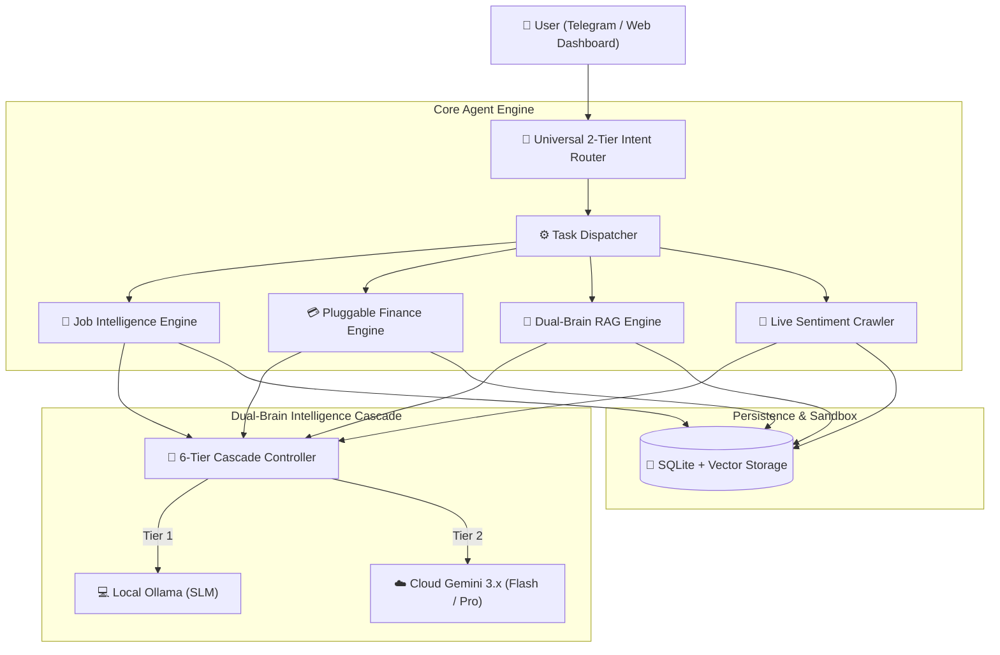

# 🚀 Crawl Research Node (CRN)
> **Lightweight Autonomous Research & Executive Intelligence Agent**  
> *Built from First Principles — Zero AutoGen / CrewAI / LangChain dependencies. Pure Python, Resource-Controlled, Local + Cloud LLM Hybrid.*

[](https://www.python.org/downloads/)
[](https://www.docker.com/)
[](GUIDEBOOK.md)
[](LICENSE)

---

## 📌 What is CRN?

**Crawl Research Node (CRN)** is a lightweight, autonomous intelligence assistant designed to operate as a 24/7 executive AI chief of staff. 

It continuously monitors live tech headlines, crawls career opportunities, evaluates candidate-job fit using LLMs, manages financial transactions via pluggable bank adapters, and provides instant RAG knowledge search over your personal research vault.

CRN is engineered from **First Principles**:
* **Explicit Python Architecture:** Zero black-box framework abstractions or loop deadlocks.
* **Dual-Brain Intelligence Cascade:** Combines local Ollama SLMs (`gemma4:e4b`, `qwen2.5-coder`) for fast local tasks with Cloud Gemini 3.x Flash/Pro for complex reasoning.
* **Deterministic Resource Control:** Low-memory Docker footprint, sliding-window rate limiters, and hybrid SQLite FTS5 + Vector indexing.

---

## 🏛 High-Level Architecture



---

## ✨ Key Capabilities

| Module | Core Functionality |
| :--- | :--- |
| **🔀 LLM Cascade Controller** | 6-tier fallback mechanism routing between local Ollama SLMs and Cloud Gemini 3.x. |
| **🔍 Dual-Brain RAG Memory** | Hybrid SQLite FTS5 lexical matching + 3072-dim Vector Cosine Similarity (`gemini-embedding-001`). |
| **💼 Job Intelligence Engine** | Async Playwright crawling, LLM candidate fit scoring (0–100%), 3-bullet pitch generation, and PDF report export. |
| **💳 Pluggable Finance Engine** | Net liquid position calculation, IMAP bank email transaction parsing, and local plugin extension support. |
| **📰 Live News & Coffee Digest** | Automated headline sentiment scoring (`indo-roBERTa-financial-sentiment-v2`) and bilingual Telegram briefings. |

---

## 🚀 Quickstart Guide

### 1. Clone Repository & Setup Environment
```bash
git clone https://github.com/belacks/ai-research.git
cd ai-research
cp .env.example .env
```

### 2. Configure Credentials
Fill in your tokens inside `.env`:
```env
TELEGRAM_BOT_TOKEN="your-bot-token"
TELEGRAM_CHAT_ID="your-chat-id"
GEMINI_API_KEY="your-gemini-api-key"
```

### 3. Customize Candidate Profile
```bash
cp shared_workspace/user_profile.txt.example shared_workspace/user_profile.txt
```
Edit `shared_workspace/user_profile.txt` with your resume baseline. *(Git-ignored for privacy).*

### 4. Launch via Docker
```bash
docker-compose up -d --build
```
Check logs: `docker logs -f claw_worker` (`Listener online and Polling active`).

---

## 📱 Telegram Interaction Examples

* `do job scan` $\rightarrow$ Triggers autonomous crawler across target job boards.
* `/jobs` $\rightarrow$ Displays top matching opportunities with tailored talking points.
* `/finance` $\rightarrow$ Displays net liquid position, daily burn rate, and liabilities.
* `can I afford 60k for snacks?` $\rightarrow$ Evaluates spending decision against budget.
* `/digest` $\rightarrow$ Generates bilingual Morning Coffee Digest.
* `/ask [query]` $\rightarrow$ RAG search over personal vault and web research.

---

## 📘 Comprehensive Documentation

For complete technical documentation, plugin creation guides, bank parser adapter specifications, and architecture details, refer to the **[CRN Complete Technical Guidebook](GUIDEBOOK.md)**.

---

## 🧪 Regression Testing

Run the 21-step automated feature test suite inside Docker:
```bash
docker exec claw_worker python3 /app/shared_workspace/test_crn_pipeline.py
```

---

## 📄 License

Distributed under the [MIT License](LICENSE).
